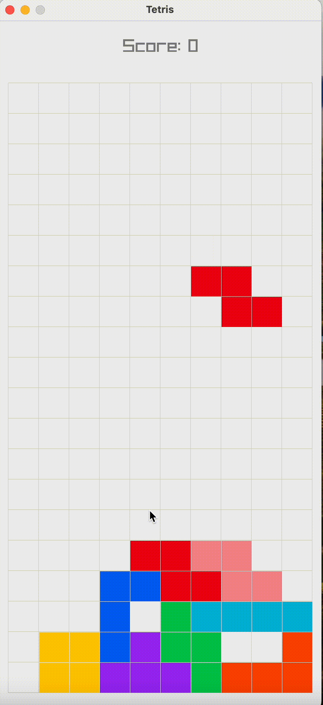

# Tetris

The most fun game ever, implemented in C using [raylib](https://www.raylib.com/).

### Getting Started

If you're running macOS, you can download the game from [here](https://github.com/vsamarth/tetris.c/releases/download/v0.1.0/tetris-0.1.0-Darwin.tar.gz), and run the executable in the `bin` directory.

You can also build the game from source using cmake, which currently builds the dependecies from
source.

From the root directory of this repository, just run

```sh
make run
```

and enjoy! 🎉

### Controls

If you are new to Tetris, the [wikipedia page](https://en.wikipedia.org/wiki/Tetris#Gameplay) provides a nice introduction to the game.

Move Left: `Left` or `A`

Move Right: `Right` or `D`

Rotate: `Up` or `W`

Soft Drop: `Down` or `S`

Hard Drop: `Space`

### Demo

Here's a demo of probably the worst Tetris run ever, by my 4 year old cousin.



### License

This project is [MIT Licensed](https://github.com/vsamarth/tetris.c/blob/main/LICENSE).
